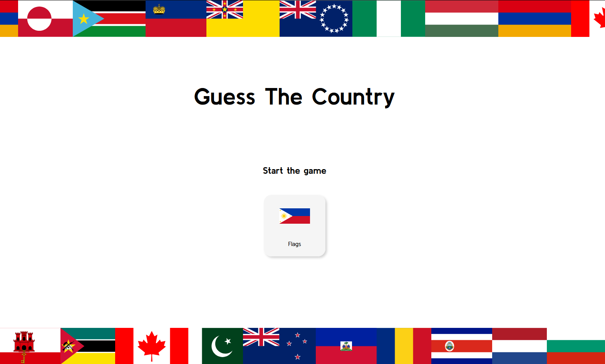
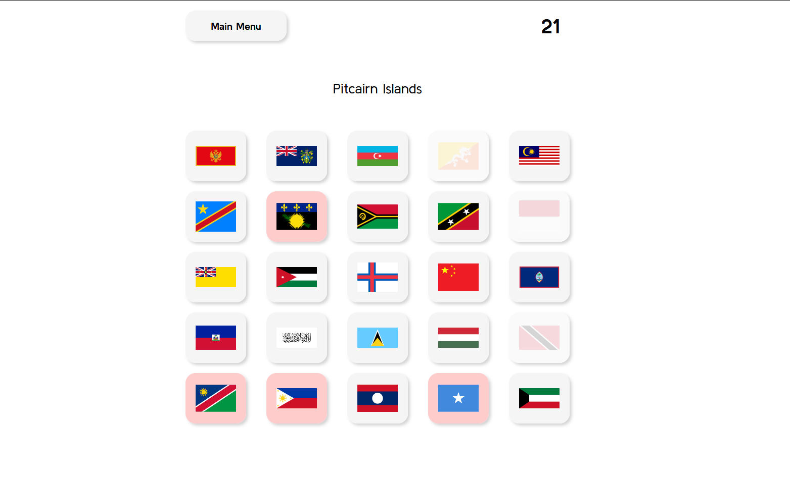
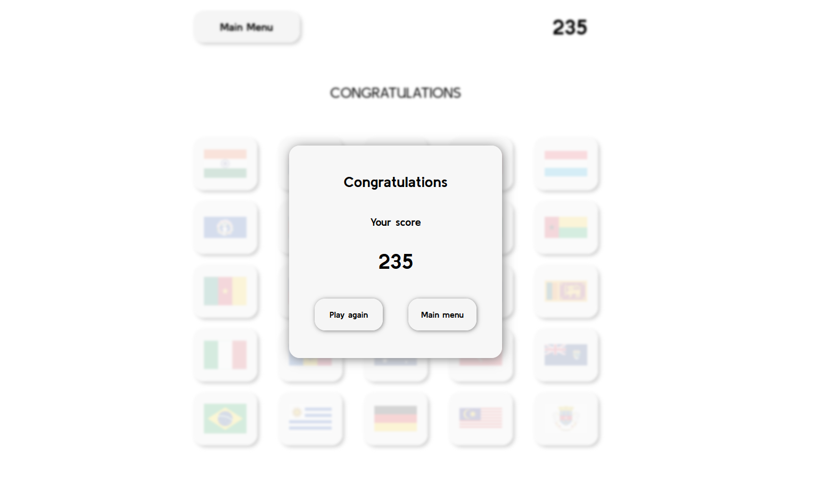

# Guess The Country 🌍

## Project Overview
"Guess The Country" is an interactive game designed to test and enhance users' geographical knowledge. The application challenges players to identify country flags. This project was created as part of my programming portfolio to showcase my skills in front-end development.

## Screenshots

  
  
  

## Features
- 🌟 **Flag Guessing Game**: A game mode where users select the correct flag matching a given country name.
- 🌟 **Scoring System**: Real-time score updates for correct and incorrect answers.
- 🌟 **Animations and Visual Effects**: Enhanced user interactions with hover effects, animations for incorrect answers, and responsive design elements.
- 🌟 **Responsiveness**: Optimized to provide a seamless experience across desktop and mobile devices.
- 🌟 **State Management**: Utilizes `localStorage` to retain game state, allowing users to continue their progress after refreshing the page.
- 🌟 **API Integration**: Fetches real-world data on countries, flags, and coats of arms using the Rest Countries API.

## Tech Stack
   
- **HTML5**: For structuring the application.
- **CSS3**: For styling, including modular and responsive design.
- **JavaScript (ES6)**: For application logic, DOM manipulation, and event handling.
- **Rest Countries API**: As a data source for countries, flags, and coats of arms.
